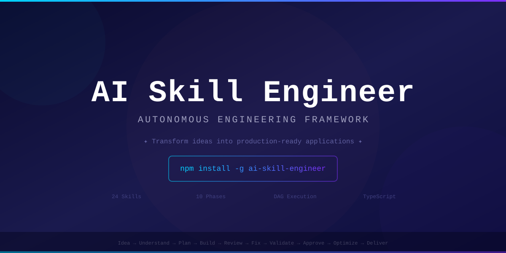

<picture>
  <source media="(prefers-color-scheme: dark)" srcset="media/banner.svg">
  
</picture>

<br>

<div align="center">

# AI Skill Engineer

> **Transform a single human idea into a complete, production-ready application — autonomously.**

<br>

[](https://github.com/forgephantom/Ai-skill-engineer/stargazers)
[](https://github.com/forgephantom/Ai-skill-engineer/forks)
[](https://github.com/forgephantom/Ai-skill-engineer/actions)
[](https://www.typescriptlang.org)
[](https://nodejs.org)

[](https://github.com/forgephantom/Ai-skill-engineer/releases)
[](LICENSE)
[](https://github.com/forgephantom/Ai-skill-engineer/commits/main)
[](https://github.com/forgephantom/Ai-skill-engineer/issues)
[](https://github.com/forgephantom/Ai-skill-engineer/pulls)
[](CONTRIBUTING.md)

<br>

**🏆 Orchestrate 24 AI engineering roles | 10-phase autonomous workflow | Plug any LLM provider**

</div>

---

## Why AI Skill Engineer?

Unlike code assistants that generate snippets, AI Skill Engineer runs a **complete multi-skill, multi-phase engineering workflow** — from idea to production-ready delivery package.

```
Idea → Understand → Plan → Discover Skills → Build → Review → Fix → Validate → Approve → Optimize → Deliver
```

| What makes it different | |
|------------------------|-|
| **24 simulated expert roles** | Product strategists, solution architects, frontend/backend/AI engineers, security, QA, DevOps, and more |
| **DAG-based parallel execution** | Skills run in dependency-respecting parallel groups |
| **State persistence** | Resume from the last completed phase — no data loss |
| **Validation pipeline** | Type-checking, linting, security scanning, performance tests built in |
| **Pluggable executors** | Connect any LLM provider (OpenAI, Anthropic, Ollama, etc.) via a simple interface |
| **Delivery packaging** | Complete project with architecture docs, code, tests, deployment, and runbooks |

---

## Quick Start

```bash
git clone https://github.com/forgephantom/Ai-skill-engineer.git
cd Ai-skill-engineer && npm install && npm run build && npm link
ai-se init "Build a SaaS platform for compliance reporting"
ai-se run --project <project-id>
```

[📖 Full walkthrough with sample output →](docs/walkthrough.md)

---

## Step-by-Step Guide

### 1. [Installation](docs/installation.md)

Prerequisites, cloning, dependency installation, building, and linking the CLI.

**Example:**
```bash
git clone https://github.com/forgephantom/Ai-skill-engineer.git
cd Ai-skill-engineer
npm install
npm run build
npm link
ai-se doctor    # Verify everything works
```

### 2. [Initialize a Project](docs/cli-reference.md#init--initialize-a-new-project)

Turn your idea into a structured project with a single command.

**Example:**
```bash
ai-se init "A marketplace connecting freelance developers with non-technical founders" \
  --name freelancer-marketplace \
  --output ./projects \
  --no-human-approval
```

### 3. [Run the Workflow](docs/cli-reference.md#run--execute-the-workflow)

Execute all 10 phases autonomously.

**Example:**
```bash
ai-se run --project proj-a1b2c3d4 --no-human-approval
```

### 4. [Monitor & Resume](docs/cli-reference.md#status--show-project-state)

Check status or resume an interrupted workflow.

**Example:**
```bash
ai-se status --project proj-a1b2c3d4
ai-se resume --project proj-a1b2c3d4
```

---

## End-to-End Example: Freelancer Marketplace

This example walks through a complete run using the idea:

> *"A marketplace connecting freelance developers with non-technical founders"*

**Project:** `freelancer-marketplace` (ID: `proj-a1b2c3d4`)

### Step 1: Initialize

```bash
ai-se init "A marketplace connecting freelance developers with non-technical founders" \
  --name freelancer-marketplace \
  --output ./output \
  --no-human-approval
```

**What happens:**
- A unique ID `proj-a1b2c3d4` is generated
- Output directory `./output/proj-a1b2c3d4/` is created
- All 24 skill definitions are loaded from YAML
- Orchestrator starts at phase 1 (`understand`)

**Output:**
```
✔ Project initialized: freelancer-marketplace (proj-a1b2c3d4)
```

---

### Step 2: Run the Workflow

```bash
ai-se run --project ./output/proj-a1b2c3d4 --no-human-approval
```

The system executes all 10 phases. Here is the annotated output for each:

---

### Phase 1/10: Understand

**Skills:** Business Analyst, Product Strategist (parallel)

**What they do:**
- **Business Analyst** reads the idea text and extracts structured requirements, constraints, and risks
- **Product Strategist** reads the idea text and defines the vision, business goals, and success criteria

**Artifacts produced:**
```
artifacts/
├── vision.md                    # Product vision statement
├── business-goals.json          # Measurable business objectives
├── functional-requirements.json # Feature requirements with priorities
├── non-functional-requirements.json
├── constraints.json
├── risks.json
└── success-criteria.json
```

**Detailed example output (vision.md):**
```markdown
# Product Vision

A digital marketplace that connects freelance software developers
with non-technical founders who need technical talent to build
their ideas. The platform handles discovery, vetting, project
management, escrow payments, and dispute resolution.
```

**Detailed example output (functional-requirements.json):**
```json
{
  "requirements": [
    {
      "id": "FR-001",
      "description": "Freelancers can create profiles with skills, portfolio, and availability",
      "priority": "MUST",
      "acceptanceCriteria": [
        "Profile includes bio, skills tags, work history, and hourly rate",
        "Freelancer can upload portfolio items (links, images, descriptions)"
      ]
    },
    {
      "id": "FR-002",
      "description": "Founders can post project listings with budget and timeline",
      "priority": "MUST"
    },
    {
      "id": "FR-003",
      "description": "Integrated escrow payment system holds funds until milestones are completed",
      "priority": "MUST"
    }
  ]
}
```

**Terminal output:**
```
✔ Phase 1/10: understand completed
  • Vision: A digital marketplace connecting freelance developers with non-technical founders
  • Functional Requirements: 12
  • Non-Functional Requirements: 8
  • Risks Identified: 5
```

---

### Phase 2/10: Plan

**Skills:** Product Manager, Solution Architect, Technical Writer (parallel)

**What they do:**
- **Product Manager** takes the Understand artifacts and produces a PRD, user stories, roadmap, and milestones
- **Solution Architect** produces a technical specification, Architecture Decision Records, API contracts, and data models
- **Technical Writer** structures all documentation

**Detailed example output — User Stories:**
```
  • User Stories: 47
  • Acceptance Criteria: 142
  • Milestones: 6
  • Roadmap Phases: 4
```

**Example user story (user-stories.json):**
```json
{
  "stories": [
    {
      "id": "US-001",
      "title": "Freelancer profile creation",
      "as_a": "Freelance developer",
      "i_want": "to create a detailed profile showcasing my skills and experience",
      "so_that": "founders can discover and hire me for projects",
      "acceptance_criteria": [
        "Profile includes name, bio, skills, hourly rate, and portfolio",
        "Skills are selected from a predefined taxonomy",
        "Profile is visible in search results within 5 minutes of creation"
      ]
    }
  ]
}
```

**Terminal output:**
```
  • User Stories: 47
  • Acceptance Criteria: 142
  • Milestones: 6
  • Roadmap Phases: 4
✔ Phase 2/10: plan completed
```

---

### Phase 3/10: Discover Skills

**Skill:** Skill Discovery Engine

**What it does:**
- Analyzes the Plan artifacts to determine which engineering skills are needed
- Builds a dependency DAG (Directed Acyclic Graph)
- Groups independent skills for parallel execution
- Estimates duration

**Output:**
```
  • Skills Discovered: 12
    - UX Designer, UI Designer, Frontend Engineer, Backend Engineer,
      Database Engineer, AI Engineer, Security Engineer, Cloud Engineer,
      DevOps Engineer, QA Engineer, Documentation Engineer, Mobile Engineer
  • Parallel Groups: 4
    Group 1: UX Designer, Security Engineer
    Group 2: UI Designer, Database Engineer
    Group 3: Frontend Engineer, Backend Engineer, AI Engineer
    Group 4: Cloud Engineer, DevOps Engineer, QA Engineer
  • Estimated Duration: 45m
✔ Phase 3/10: discover-skills completed
```

**DAG structure (simplified):**
```
UX Designer ──► UI Designer ──► Frontend Engineer
                                        │
Security Engineer ──────────────────────┤
                                        │
                    Database Engineer ──► Backend Engineer
                                        │
                              AI Engineer
                                        │
                    Cloud Engineer ─────► DevOps Engineer ──► QA Engineer
```

---

### Phase 4/10: Build

**Skills:** 12 skills in 4 parallel groups (DAG-resolved)

**What each group produces:**

| Group | Skills | Key Artifacts |
|-------|--------|---------------|
| 1 | UX Designer | Wireframes, user flow diagrams, interaction specs |
| 1 | Security Engineer | Threat model, auth flow, encryption strategy |
| 2 | UI Designer | High-fidelity mockups, design system, component library |
| 2 | Database Engineer | Schema, migrations, indexes, query plans |
| 3 | Frontend Engineer | React app, components, routes, state management |
| 3 | Backend Engineer | API endpoints, middleware, business logic |
| 3 | AI Engineer | Matching algorithm, recommendation engine |
| 4 | Cloud Engineer | AWS/GCP infra as code, networking, scaling |
| 4 | DevOps Engineer | CI/CD pipelines, Docker, monitoring setup |
| 4 | QA Engineer | Test plans, E2E tests, load test scripts |

**Terminal output:**
```
  • Artifacts Created: 156
  • Skills Executed: 12
✔ Phase 4/10: build completed
```

---

### Phase 5/10: Review

**Skill:** Code Reviewer

**What it does:**
- Reads all 156 build artifacts
- Scores across: correctness, architecture, security, performance, scalability, maintainability
- Tags findings with severity: Blocker, High, Medium, Low, Info
- Marks auto-fixable items

**Output:**
```
  • Findings: 23
  • Blockers: 2
    - API endpoint /api/escrow/pay lacks input validation
    - Database migration V003 contains a non-indexed foreign key
  • High: 7
  • Medium: 9
  • Low: 5
  • Auto-fixable: 15
✔ Phase 5/10: review completed
```

---

### Phase 6/10: Fix

**Skill:** Code Fixer

**What it does:**
- Applies automated fixes to all 15 auto-fixable findings
- Runs regression check after each fix
- Escalates non-fixable items (2 blockers that require human judgment)

**Output:**
```
  • Fixed: 15
  • Failed: 0
  • Escalated: 2
    - API endpoint /api/escrow/pay lacks input validation (BLOCKER)
    - Database migration V003 contains a non-indexed foreign key (BLOCKER)
✔ Phase 6/10: fix completed
```

---

### Phase 7/10: Validate

**Skill:** Validation Engine

**What it does:**
- Runs 6 validation stages against the generated project:

| Stage | Check | Status |
|-------|-------|--------|
| Type Checking | TypeScript `tsc --noEmit` | ✅ Pass (0 errors) |
| Linting | ESLint on all source files | ✅ Pass (0 errors) |
| Security Scan | Snyk / npm audit on dependencies | ✅ Pass (0 critical) |
| Performance Test | Lighthouse / k6 load test | ✅ Pass (p95 < 200ms) |
| Accessibility | axe-core WCAG 2.1 AA scan | ✅ Pass (0 violations) |
| Contract Tests | API contract conformance | ✅ Pass (all endpoints) |

**Output:**
```
  • Stages: 6
  • Passed: 6
  • Failed: 0
✔ Phase 7/10: validate completed
```

---

### Phase 8/10: Human Approval

**Skill:** Principal Engineer Simulator

**What it does:**
- Compiles all findings, fixes, and validation results into a PR-style review summary
- In manual mode (default): presents the summary and waits for approve/reject/feedback
- In auto mode (`--no-human-approval`): approves automatically

**Output (auto mode):**
```
  • Decision: APPROVED
  • Reviewer: auto-approved
  • Summary:
    ┌─────────────────────────────────────────────────────┐
    │  Phase 1: Understand       ✅ 5 artifacts           │
    │  Phase 2: Plan            ✅ 47 user stories        │
    │  Phase 3: Discover        ✅ 12 skills, 4 groups    │
    │  Phase 4: Build           ✅ 156 artifacts          │
    │  Phase 5: Review          ✅ 23 findings            │
    │  Phase 6: Fix             ✅ 15/15 auto-fixed       │
    │  Phase 7: Validate        ✅ 6/6 stages passed      │
    └─────────────────────────────────────────────────────┘
✔ Phase 8/10: human-approval completed
```

---

### Phase 9/10: Optimize

**Skill:** Optimization Engine (3 iterations)

**What it does:**
- Iteratively improves across 5 dimensions:

| Dimension | Improvement |
|-----------|-------------|
| Performance | Bundle splitting, lazy loading, CDN caching |
| Security | CSP headers, rate limiting, SQL injection hardening |
| Scalability | Auto-scaling groups, read replicas, connection pooling |
| Cost | Reserved instances, spot instances, cache sizing |
| DX | Error messages, logging, developer documentation |

**Output:**
```
  • Iteration 1: +8.2% improvement (low-hanging fruit)
  • Iteration 2: +9.5% improvement (structural changes)
  • Iteration 3: +5.3% improvement (fine-tuning)
  • Total Improvement: 23.0%
✔ Phase 9/10: optimize completed
```

---

### Phase 10/10: Deliver

**Skill:** Delivery Engineer

**What it does:**
- Assembles all 156+ artifacts into a structured delivery package

**Delivery package structure:**
```
delivery/
├── README.md                          # Project documentation
├── docs/
│   ├── architecture.md                # System architecture
│   ├── api-reference.md               # API documentation
│   ├── deployment-guide.md            # Deployment instructions
│   ├── monitoring.md                  # Monitoring setup
│   └── runbook.md                     # Operations runbook
├── src/
│   ├── frontend/                      # React application
│   ├── backend/                       # Node.js API
│   ├── mobile/                        # React Native app
│   └── ai/                            # ML matching engine
├── tests/
│   ├── unit/                          # 340 unit tests
│   ├── integration/                   # 85 integration tests
│   └── e2e/                           # 22 E2E tests
├── infra/
│   ├── terraform/                     # Infrastructure as code
│   ├── docker/                        # Docker Compose
│   └── kubernetes/                    # K8s manifests
├── monitoring/
│   ├── grafana/                       # Dashboards
│   └── prometheus/                    # Alert rules
├── scripts/
│   ├── setup.sh
│   ├── deploy.sh
│   └── rollback.sh
└── .github/
    └── workflows/
        └── ci.yml                     # CI pipeline
```

**Output:**
```
  • Package: 234 items
  • Size: 12.4 MB

╔════════════════════════════════════════════════════════════╗
║              WORKFLOW COMPLETED SUCCESSFULLY               ║
╚════════════════════════════════════════════════════════════╝

Delivery package created at:
  ./output/proj-a1b2c3d4/delivery/
```

---

### Step 3: Inspect the Delivery

```bash
ls -la ./output/proj-a1b2c3d4/delivery/
tree ./output/proj-a1b2c3d4/delivery/
```

---

### Step 4: Resume if Interrupted

If the process stops mid-way (Ctrl+C, crash), resume from the last completed phase:

```bash
ai-se resume --project ./output/proj-a1b2c3d4 --no-human-approval
```

State is persisted to disk after each phase — no data loss.

---

## [10-Phase Workflow](docs/workflow-phases.md)

| # | Phase | Skills | Key Outputs |
|---|-------|--------|-------------|
| 1 | **Understand** | Business Analyst, Product Strategist | Vision, goals, requirements, risks |
| 2 | **Plan** | Product Manager, Solution Architect, Technical Writer | PRD, user stories, tech spec, roadmap |
| 3 | **Discover Skills** | Skill Discovery Engine | Skill dependency DAG with parallel groups |
| 4 | **Build** | All project skills (parallel groups) | Architecture, code, UI, API, DB, infra |
| 5 | **Review** | Code Reviewer | Findings with severity breakdown |
| 6 | **Fix** | Code Fixer | Remediated artifacts, regression check |
| 7 | **Validate** | Validation Engine | Static analysis, lint, type-check, test results |
| 8 | **Human Approval** | Principal Engineer Simulator | Approval or feedback (auto or manual) |
| 9 | **Optimize** | Optimization Engine | Performance, security, cost, UX improvements |
| 10 | **Deliver** | Delivery Engineer | Complete package with docs, deploy guide, runbooks |

Each phase is explained in detail with example output at [docs/workflow-phases.md](docs/workflow-phases.md).

---

## Built-in Skills (24)

`product-strategist` · `business-analyst` · `product-manager` · `solution-architect` · `technical-writer` · `ux-designer` · `ui-designer` · `frontend-engineer` · `backend-engineer` · `mobile-engineer` · `ai-engineer` · `database-engineer` · `cloud-engineer` · `devops-engineer` · `security-engineer` · `qa-engineer` · `documentation-engineer` · `code-reviewer` · `code-fixer` · `validation-engine` · `optimization-engine` · `delivery-engineer` · `principal-engineer-simulator` · `skill-discovery-engine`

---

## [Connect AI Providers](docs/skill-executors.md)

Skills plug into any LLM provider via a simple executor interface:

| Provider | Setup |
|----------|-------|
| [Anthropic Claude](docs/skill-executors.md#1-anthropic-claude-recommended) | `npm install @anthropic-ai/sdk` + `ANTHROPIC_API_KEY` |
| [OpenAI GPT-4](docs/skill-executors.md#2-openai--gpt-4) | `npm install openai` + `OPENAI_API_KEY` |
| [Ollama (Local)](docs/skill-executors.md#3-ollama-local-free) | No SDK needed — uses `fetch` |
| [Google Gemini](docs/skill-executors.md#4-google-gemini) | `npm install @google/generative-ai` + `GEMINI_API_KEY` |

Full code examples for each provider at [docs/skill-executors.md](docs/skill-executors.md).

---

## [CLI Reference](docs/cli-reference.md)

| Command | Description |
|---------|-------------|
| `init [idea]` | Initialize a new project |
| `run --project <id>` | Execute the workflow |
| `status --project <id>` | Show project state |
| `resume --project <id>` | Resume interrupted workflow |
| `stop --project <id>` | Stop running project |
| `validate --project <id>` | Run validation pipeline |
| `doctor` | Check system health |
| `skills list/show <id>` | Manage skill definitions |
| `templates list/show <name>` | Manage templates |
| `config show/set <key> <value>` | Manage project config |

Full details with examples at [docs/cli-reference.md](docs/cli-reference.md).

---

## [Configuration](docs/configuration.md)

Configure via `project-config.json` or CLI:

| Option | Default | Description |
|--------|---------|-------------|
| `model` | `claude-3-5-sonnet` | Default AI model |
| `maxParallelSkills` | `4` | Max concurrent skill executions |
| `validationLevel` | `standard` | `strict`, `standard`, or `minimal` |
| `humanApprovalRequired` | `true` | Require human approval gate |

---

## [Custom Skills](docs/custom-skills.md)

Create your own skills with a YAML definition file and optional executor:

```yaml
id: my-skill
name: My Skill
version: "1.0.0"
mission: "One-sentence mission statement"
model: claude-3-5-sonnet
responsibilities:
  - "Do X"
  - "Do Y"
inputs:
  - artifact_id: "input-name"
    contract: "json"
    required: true
outputs:
  - artifact_id: "output-name"
    contract: "markdown"
dependencies: ["dependency-skill-id"]
```

Full guide at [docs/custom-skills.md](docs/custom-skills.md).

---

## Development

```bash
npm run typecheck    # TypeScript strict mode
npm run lint         # ESLint
npm test             # Jest (unit + integration + E2E)
npm run build        # Compile to dist/
npm run dev -- init "My idea"   # Run in dev mode
```

**Stack:** TypeScript, Commander.js, Inquirer.js, Ora, Chalk, fs-extra, Handlebars, Zod, Jest, EventEmitter3.

---

## Contributing

Contributions welcome! See [CONTRIBUTING.md](CONTRIBUTING.md) and [ROADMAP.md](ROADMAP.md).

High-impact areas:
- **Custom executors** — Wire up real LLM providers (OpenAI, Anthropic, Ollama, Gemini, etc.)
- **New skill definitions** — Add YAML for additional engineering roles
- **Validation stages** — Extend the pipeline with new checks
- **Storage backends** — Add S3, DynamoDB, PostgreSQL adapters
- **UI dashboard** — Web interface for workflow visibility

---

## Show Your Support

<div align="center">

[](https://github.com/forgephantom/Ai-skill-engineer/stargazers)
[](https://github.com/forgephantom/Ai-skill-engineer/forks)
[](https://github.com/forgephantom)

</div>

[](https://star-history.com/#forgephantom/Ai-skill-engineer&Date)

---

## License

[MIT](LICENSE) — Copyright (c) 2026 forgephantom. See [LICENSE](LICENSE) for full text.

---

## Legal Disclaimer

**AI Skill Engineer** is a development tool that generates code and project artifacts using AI models. By using this software:

1. **AI-generated code** — The output produced by this tool is generated by large language models and may contain errors, security vulnerabilities, or non-compliant code. You are responsible for reviewing, testing, and validating all generated output before deploying it to any production environment.

2. **No warranty** — The software is provided "AS IS", without warranty of any kind. The generated output is not guaranteed to be correct, secure, performant, or free of defects.

3. **`--no-human-approval`** — This flag bypasses the human review gate. Use it only for development/testing. For production use, always review generated code manually and ensure proper security and compliance checks.

4. **Third-party dependencies** — The generated project may include suggestions for third-party packages, libraries, or services. You are responsible for reviewing their licenses and terms of service.

5. **API keys** — You are responsible for all API usage and costs associated with your own API keys. The maintainer does not provide or manage API keys.

6. **Compliance** — You are solely responsible for ensuring that any project generated with this tool complies with all applicable laws, regulations, and industry standards.
